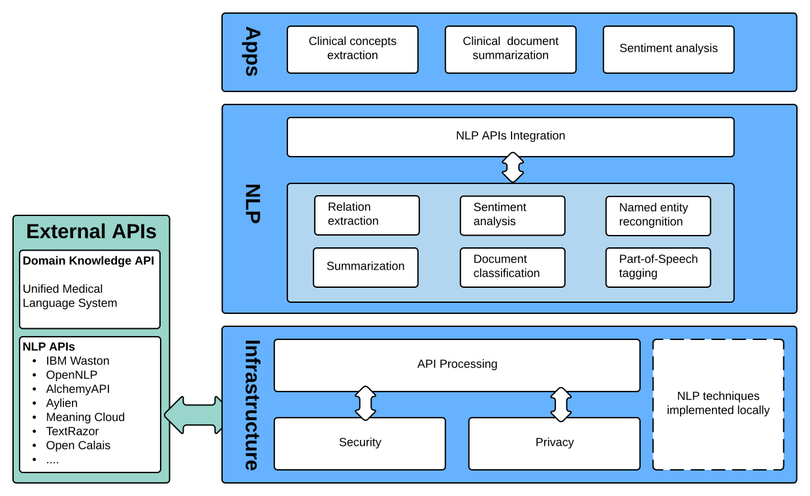

## About MABNLP

MABNLP is a prototype that intends to extract clinical concepts from clinical free-texts, such as discharge summaries, clinical reports and etc. It was developed based on a scalable API-based architecture using Laravel. The architecture is shown as follows:
<p align="center"></p>

Laravel is accessible, yet powerful, providing tools needed for large, robust applications. A superb combination of simplicity, elegance, and innovation give you tools you need to build any application with which you are tasked. Laravel attempts to take the pain out of development by easing common tasks used in the majority of web projects, such as: [routing](https://laravel.com/docs/routing), [session](https://laravel.com/docs/session), [database ORM](https://laravel.com/docs/eloquent), and etc. 

## Using MABNLP

### Create accounts of NLP APIs

Since MABNLP uses external NLP APIs, you need to first get accounts from the NLP API providers and with the accounts you'll obtain free access to their APIs. However, most of providers start to charge on usage after you have passed certain threshold. Please refer to the documentations of each provider for more details. 

After you have the accounts, update the keys in 'entityextraction.js'. The following shows how to update IBM watson-NLU's access keys.

````javascript
function RunWatson(text,docid){
    var username = ""; // your username
    var password = ""; // your password
    var baseurl = ""; // api url

    var outputmode = "json";
    var apikey = ""; // api key

    ShowOrHideLoader();

    return $.ajax({
        // send requests to the API
    });

}
````

### Obtain datasets from i2b2

Obtain datasets for the 2008 Obesity Challenge and the 2009 Medication Challenge from [i2b2](https://www.i2b2.org/NLP/DataSets/Main.php). Then put dataset under './public/Documents/i2b2/'

### Prepare the environment for running the prototype

[Installation of Laravel](https://laravel.com/docs/5.6)

### Local Development Server

If you have PHP installed locally and you would like to use PHP's built-in development server to serve your application, you may use the serve Artisan command. This command will start a development server at http://localhost:8000:

````
php artisan serve
````

## Security Vulnerabilities

Privacy: The prototype has not implemented the de-identification technique for anonymizing patients' data. Therefore, it's not feasible to test it in clinical practice. 

## Reference
Paper submitted

## License

The prototype is open-sourced software licensed under the [MIT license](http://opensource.org/licenses/MIT).
